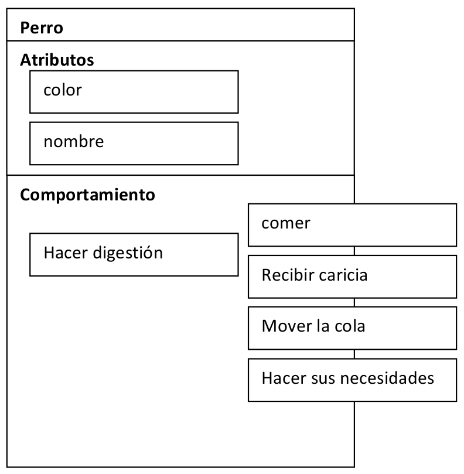
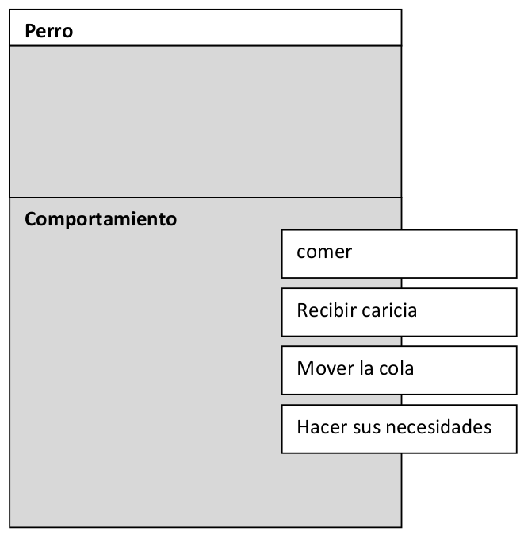

# Empezar a plasmar los objetos en un diseño

En este capítulo empezaremos a ver cómo transformar los objetos que detectamos en nuestra observación de la _“realidad”_ en algo _“informáticamente”_ palpable.

>_"Hay dos maneras de diseñar software: una es hacerlo tan simple que sea obvia su falta de deficiencias, y la otra es hacerlo tan complejo que no haya deficiencias obvias"_ -- C.A.R. Hoare

## Cómo representar la estructura de los objetos

En un capítulo anterior habíamos hablado de una situación de la realidad donde una niña (mi hija)  interactuaba con un perro, **así que vamos a ir por partes y tratar de representar lo que podemos interpretar del texto** que está en un lenguaje natural y nos describe claramente los objetos y sus relaciones:

>Micaela, de 5 años, dice: _“mira el perro negro y blanco, se llama Tito, le toco la cabeza y mueve la cola, y si le doy de comer, al rato, hace caca”_.

Si nos concentramos en el perro, tenemos que:

**Atributos**
- Color
- Nombre

**Comportamiento**
- Se le puede tocar la cabeza
- Mueve la cola
- Puede comer
- Sabe hacer sus necesidades

Y se desprende prestando atención a la lectura del texto que define nuestro contexto.

1. **_“Los Objetos tienen Atributos, Comportamientos y Estados”_**

    Todos los objetos tienen “atributos”,”comportamientos” (“métodos”) y un “estado”. Este último no es más que la información que tienen los atributos en un momento dado.

2. **_Un perro se llamará “Tito” y otro “Ruffo”_**, pero el atributo es el mismo (_“nombre”_). Si mañana el perro cambia de nombre, lo que cambia es _“su estado”_ y el mecanismo para cambiar el estado serán sus métodos (_“cambiar el nombre”_).

3. **_“La clase, un molde para construir objetos”_**

    Este ejemplo es muy usado para tratar de transmitir el concepto que hay detrás. **Podríamos decir que si _“jugáramos a ser Dios”_, primero definiríamos un diseño de cómo va a ser la criatura que queremos crear**, haríamos un _“molde”_ a partir de ese diseño, y posteriormente podríamos crear _“vida”_ con similares características, pero que siempre serán _“objetos únicos”_.

**“Crear Personas”**

Por ejemplo, si quiero crear _“Personas”_ diría que todas tendrán un sexo (masculino / femenino), dos piernas, dos brazos, una cabeza y pelo sobre ella (es un diseño simple para un contexto simple, si fuera otro el contexto, muy probablemente debería cambiar mi diseño).

**“Crear Perros”**

Por ejemplo, podría decir que los _“Perros”_ también tendrían un sexo, pero ahora tendrían cuatro patas, una cabeza y pelo sobre todo su cuerpo.

Para ambos ejemplos **ya cuento con dos moldes, el de Personas y el de Perros**, por lo tanto ahora puedo crear a Micaela y a Tito, pero también podría crear a Martina y a Ruffo, por lo que tendríamos dos personas y dos perros, con características similares, pero que serían a su vez criaturas únicas, identificables y distinguibles entre las demás criaturas, aún entre las criaturas del mismo tipo (aunque se llamaran igual y tuvieran los mismos rasgos, serían solo parecidos).

4. **_“Los atributos y comportamientos pueden ser públicos o privados”_**

    Existirá información y comportamientos que serán conocidos por otros objetos (**_“acceso público”_**) y esto permitirá que se pueda generar una interacción entre ellos. También existirá información y comportamientos que serán internos de cada objeto (**_“acceso privado”_**) y no serán conocidos por los demás objetos.

Un diseño posible para nuestro Perro podría ser:

**Cómo se debería leer este diagrama:**

- **Todo lo que se encuentre dentro de la representación _“Perro”_ es _“interno y privado”_** (invisible para el exterior) y lo que se encuentre **_“una parte dentro y otra afuera”_ será nuestra _“interfaz”_ con el exterior, los _“comportamientos públicos”_** del objeto que serán invocados por los _“mensajes”_ enviados por otro objeto que quiere interactuar con nosotros.
- Un objeto de tipo _“Perro”_ tiene como atributos su _“color”_ y su _“nombre”_
- Dentro de los posibles comportamientos públicos de nuestro perro podrían ser _“comer”_, _“recibir una caricia”_, etc.
- Dentro de los posibles comportamientos privados de nuestro perro podría ser _“hacer la digestión”_, que muy probablemente será activada a través de otros métodos (como _“comer”_).

**Qué es lo que vería Micaela desde el exterior:**

Solo podríamos interactuar con lo que es _“público”_ del diseño, como así lo decidimos. Ahora la pregunta sería **_“¿Qué debería ser público y qué debería ser privado?”_**, bueno, intentemos usar el sentido común:

- **El perro necesita poder interactuar con su exterior de alguna forma**, pero existirán _“detalles”_ que no conciernen al exterior ni nos interesa que otro objeto pueda modificar a su antojo.

Por ejemplo, **Micaela no tiene por qué saber cómo es el mecanismo de digestión de un perro**, qué órganos entran en juego durante todo el proceso, es más, por la vida del perro creo que **tampoco Micaela debería poder tener la potestad para cambiarlo a su antojo** (ya que seguro estaría en peligro la vida del perro).

Lo que sí sucederá es que **Micaela generará indirectamente que se active el mecanismo interno de digestión al darle de comer al Perro** (_“Micaela le dice al perro que coma”_, lo que se debe traducir como _“Micaela le envió un mensaje al perro”_), pero esto ocurrirá sin que Micaela sepa que sucede, solo podrá apreciar sus resultados cuando el perro haga sus necesidades (ya que las necesidades no salen solas).

Ahora bien, **¿de quién es la responsabilidad de definir todas estas reglas?**

Si, obviamente, la responsabilidad es nuestra, y un diseño será más débil o más robusto de acuerdo a cómo nosotros pensemos que deben reaccionar nuestros objetos a los mensajes que recibirán del exterior y cuanto oculten de sus propios detalles de implementación.

**Nota del Autor**: esto es un ejemplo teórico para tratar de transmitir varios conceptos, como todo diseño, tendrá debilidades y fortalezas, y si cambiamos de contexto, muy probablemente este diseño no servirá (no dudo que en este momento estarán pensando **_“que pasaría si...”_** y muy probablemente se encuentren con que algo no se puede hacer... bueno, vayamos paso a paso y veremos de a poco el horizonte, pero ya les voy adelantando: **no existen diseños que pueda funcionar en absolutamente todos los contextos posibles**, por esta razón es importante definir _“el contexto”_ de nuestro sistema.

>**Nota**: a menos que estemos hablando concretamente de patrones de diseño, pero aún así se define en qué contextos se podrían aplicar y en cuales no.

**Por ejemplo:** el diseño de una clase Persona no será exactamente el mismo si estamos hablando de un sistema de reserva de películas, una universidad con alumnos o un sistema de salud. Tendrán cosas comunes, pero su diseño no será necesariamente el mismo.

En mi opinión no existe el **_“100% de reuso puro”_**, existirán componentes que dada su naturaleza sí podrán usarse en distintos contextos y otros directamente no, a menos tal vez que hayamos pensado de entrada que así debíamos diseñar nuestros componetes: _“reusables en varios contextos”_, aunque esto podría aumentar exponencialmente la complejidad del componente o de los sistemas.

Para más información sobre el apasionante tema sobre _“diseño”_ se recomienda leer el siguiente artículo de Martín Fowler: [**_“¿Ha muerto el diseño?”_**](https://www.martinfowler.com/articles/designDead.html)

## En Resumen

**Las clases se construyen en la etapa de diseño** donde definimos qué es lo que queremos crear. Lo que creamos a partir de ellas es un objeto que _“tendrá vida”_ (será lo que verdaderamente se ejecutará en nuestro sistema) y a la vez _“único”_ (podrán existir muchos objetos del mismo tipo, pero podremos interactuar con ellos e identificarlos de forma única).

Dentro de las definiciones de la clase **tenemos los atributos y los comportamientos** que tendrá nuestra creación, algunos de ellos **serán públicos y otros serán privados**. Todo lo que definamos como público será nuestra _“conexión”_ con el exterior y permitirá la interacción entre los objetos. Esta interacción se dará a través de **envíos de mensajes entre objetos**, como por ejemplo _“Micaela le da de comer al perro”_, por lo que existirán dos objetos, uno que puede _“comer”_ y otro que puede decirle al otro _“que coma”_ (si no existen estos métodos, el perro directamente no hará nada y estará desconectado con el exterior).

**Esto se clarificará cuando empecemos a usar los diagramas UML** (similares al diagrama presentado anteriormente) y a traducirlos en código concreto y ejecutable.

>_"Codifica siempre como si la persona que finalmente mantendrá tu código fuera un psicópata violento que sabe dónde vives"_ -- Martin Golding

