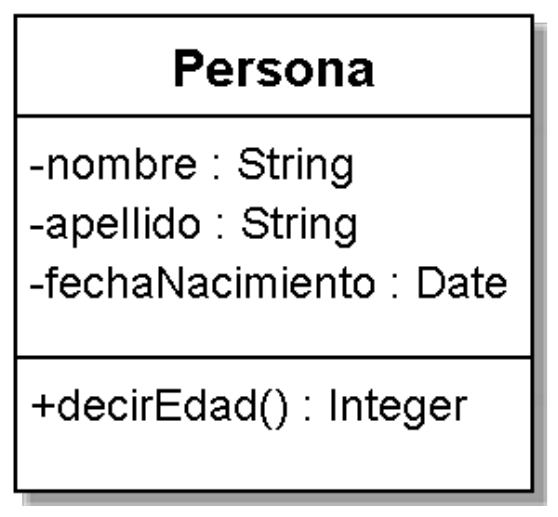
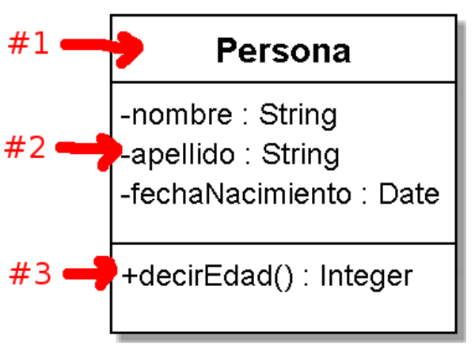
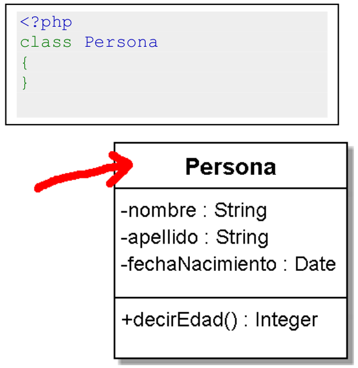
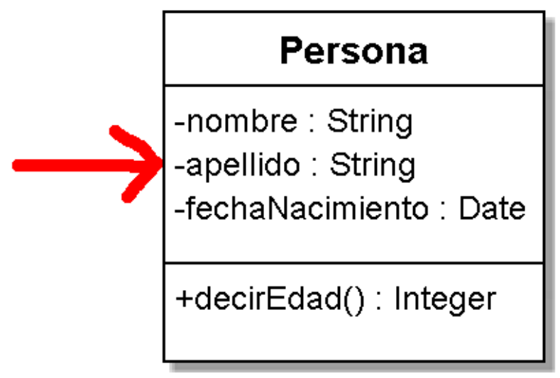
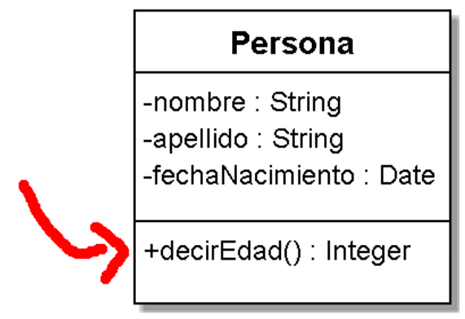
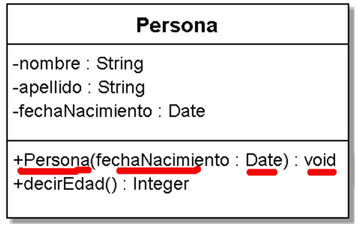

# Cómo representar una clase en UML

Empezamos con los primeros pasos en el Lenguaje Unificado de Modelado (UML) y usa las herramientas que te sean más cómodas, o directamente dibujando en un papel o una pizarra (lo que puedes luego fotografiar y subir a una wiki).

Lo que importa son los conceptos.

>"Primero resuelve el problema. Entonces, escribe el código" -- John Johnson

**PHP tiene Estándares:** aunque no lo crean, que para no ser menos- seguiremos al pié de la letra.

## Conceptos Generales

**Primer Regla:** de nomenclatura, **los nombres de las clases** son siempre en singular y la primer letra de cada palabra en mayúsculas (CamelCase), al revés de los nombres de las tablas de una base de datos, generalmente en plural y en minúsculas:

- Tablas en base de datos: personas, animales, usuarios, usuarios_administradores
- Clases en POO: Persona, Animal, Usuario, UsuarioAdministrador

## Mi primer diagrama UML

Definamos un contexto para luego diseñarlo con UML:

_“Una persona tiene nombre, apellido y fecha de nacimiento, cuando se le pregunta qué edad tiene,  responde con su edad que calcula en base a la fecha de nacimiento”_

Y el diagrama UML debería verse de la siguiente manera:



Este diagrama se debe leer de la siguiente forma:



- **La Sección #1** es para definir el **nombre de la clase** (como explicamos al principio, usando CamelCase).

- **La Sección #2** es para definir **los atributos de nuestra clase (camelCase, pero a diferencia de las clases, inician con minúscula),** la visibilidad de cada uno (el signo _“`-`“_ para privado, el signo _“`+`”_ para público) y qué tipo de dato debería ser (no importa si el lenguaje lo soporta exactamente, recuerda que UML es independiente del lenguaje).
- **La Sección #3** es para definir **los métodos de nuestra clase (camelCase, igual que con los atributos),** la visibilidad de cada uno, los parámetros que pueden recibir y si retornan o no alguna información (para ambos casos, especificando el tipo de dato).

**Regla: _“todos los atributos de una clase son por defecto no-públicos”_.**

Existe una convención (que casi no se discute) desde los principios de la POO que si cualquiera desde el exterior puede conocer y modificar los atributos de un objeto, y por ende, su _“estado”_, todo diseño será débil (este tema lo veremos más en profundidad cuando tratemos el tema _“métodos accesores / modificadores”_).

## Cómo se traduce en código

Vayamos por partes, empieza por arriba y sigue secuencialmente hacia abajo, y la traducción se hará muy simple y natural.

## Sección #1 – nombre de la clase

Siguiendo la nomenclatura del estándar, deberíamos primero crear un archivo / fichero con el mismo nombre que la clase: **Persona.php**

Posteriormente, todo se traduce en:



## Sección #2 – los atributos de la clase

Según el diagrama, tenemos 3 atributos, todos _“privados”_ (signo _“`-`“_) y dos serán de tipo `String` (cadena de caracteres) y uno de tipo `Date` (fecha).



Aquí es donde tenemos que interpretar el diagrama y ajustarlo a nuestro lenguaje. Si quisiéramos traducir esta clase a Java no tendríamos problema porque existen _“clases base”_ (ya que en Java _“todo es un objeto”) como `String`, `Integer`, `Date`, etc. Pero, como no tenemos esta posibilidad en PHP (aún, espero que en un futuro cercano sí), podemos enfrentarlo de dos maneras, la manera simple y pragmática, o la estricta y dogmática.

**Estándar de Codificación**

>Como podrán apreciar en el primer código de ejemplo sucede algo atípico: nuestra clase tiene las llaves a la izquierda y no existe el tag de cierre ?>

>Todo corresponde al estándar de codificación de PHP, particularmente para el último caso se omite cuando el archivo usará solo código PHP y no con HTML embebido.

**Versión pragmática**

```php
<?php
class Persona
{
    private $_nombre;
    private $_apellido;
    private $_fechaNacimiento;
}
```

**Comentario aparte:** perfectamente podríamos haber usado una traducción directa de los atributos y decir que son `$nombre`, `$apellido` y `$fechaNacimiento`, pero como estamos siguiendo el estándar definido por PHP, usaremos el agregado `$_` para todos los atributos que son _“privados”_. No olvidar, esto no es un problema que debe contemplar UML, ya es un problema del lenguaje de turno, en nuestro caso, PHP.

**Versión dogmática**

Por ejemplo, como Java es un lenguaje de _“fuertemente tipado”_, cada uno de los atributos se traducirían de la siguiente forma:

Código JAVA:

```java
public class Persona{
    private String nombre;
    private String apellido;
    private Date fechaNacimiento;
}
```

Pero como PHP es un lenguaje de _“tipado dinámico”_ no requiere definir inicialmente un tipo para sus variables, el tipo es definido dinámicamente cuando se hace una asignación de valor (y su uso también [dependerá del contexto en donde se encuentre](https://www.php.net/manual/es/language.types.type-juggling.php)).

Lo máximo que podríamos hacer es:

```php
<?php
class Persona
{
    private $_nombre = '';
    private $_apellido = '';
    private $_fechaNacimiento = '';
}
```

Al asignarle un valor por defecto de tipo `String`, su atributo sería de tipo `String` y cumpliríamos exactamente con el diagrama, a no ser por la fecha, porque [no tenemos nada parecido a `Date`](https://www.php.net/manual/es/language.types.php).

Si tuviéramos la necesidad de definir un Integer, simplemente asignaríamos un 0 a nuestro atributo, por ejemplo:

```php
private $_edad = 0;
```

**SUGERENCIA, sean PRAGMÁTICOS:** no conviene perder mucho más tiempo con esto ya que como PHP es de asignación dinámica de tipos, el hecho que definamos en el comienzo un valor por defecto no asegura que se vaya a mantener, y **UML es un medio y no un fin en sí mismo**. El mensaje que nos debe quedar es que ese atributo debe manejar este tipo de dato, y nosotros como desarrolladores estamos siendo notificados de ello y somos responsables de ver luego qué controles deberemos agregar para que se cumpla en el resto de la clase.

Por ejemplo, imaginemos lo siguiente: **_“la documentación que nos entregó nuestro director de sistemas dice que manejarán valores de tipo `Date` en el atributo `fechaNacimiento`”_** por consiguiente no deberíamos permitir el uso de algo que no sea de tipo `Date`, así tendrá coherencia el diseño con la implementación. Si el código no respeta el diseño, el código está mal y hay que corregirlo.

## Sección #3 – los métodos de la clase

Finalmente, la traducción de los métodos. Aquí tenemos **un método público (signo _“`+`”_)**, que no recibe parámetros (los paréntesis están vacíos) y luego de los _“`:`”_ representan qué tipo de valor retornará (en este caso será un número entero que representará la edad).

En este ejemplo se puede ver un detalle importante: **¿cómo y cuando se define el valor de la fecha de nacimiento de la persona?**




**Respuesta:** en ningún momento, el diagrama UML no dice nada, aquí está supeditado al público objetivo de la documentación y a su interpretación. Cabe aclarar que cuando se entrega un diagrama UML no solo van los dibujos, también se acompañan con más información escrita explicando los posibles detalles o problemas de la implementación, o simplemente se hará una reunión para tratar el tema y sacar dudas.

**El resultado en código sería:**

```php
<?php
class Persona
{
    private $_nombre;
    private $_apellido;
    private $_fechaNacimiento;

    public function decirEdad()
    {
        /* calculo la fecha a partir de $_fechaNacimiento */
        return $edadCalculada;
    }
}
```

## El Constructor

Si tuviéramos la necesidad de documentar alguna particularidad del **constructor**, lo que generalmente se hace es **agregar un método con el mismo nombre de la clase**, lo que representaría _“el constructor”_ de la clase (sintácticamente sería similar a como lo hace Java y cómo lo hacía PHP4, ya que cambia en PHP5 por la palabra reservada [`__construct()`](https://www.php.net/manual/es/language.oop5.decon.php) ).



**Nota:* al no existir el tipo `Date` lo que se hace es recibir un parámetro y pasarle el valor al atributo que se encuentra protegido internamente en la clase (_“atributo privado”_).

**El elemento _“void”_**: significa _“vacío”_, _“nada”_, es decir, debemos leerlo como _“este método no retorna nada”_. En los diagramas UML podemos encontrar que todo lo que no devuelva nada o no tenga tipo, es de tipo _“void”_. También podemos encontrar que directamente se omita y no se muestre nada al final del método (eliminado _“`:void`”_ del final).

`Persona.php`
```php
<?php
class Persona
{
    private $_fechaNacimiento;

    /**
    *
    * @param string $fechaNacimiento 5/8/1973
    */
    public function __construct($fechaNacimiento)
    {
        $this->_fechaNacimiento = $fechaNacimiento;
    }
    
    public function decirEdad()
    {
        return $this->_calcularEdad();
    }
    
    private function _calcularEdad()
    {
        $diaActual = date(j);
        $mesActual= date(n);
        $añoActual = date(Y);

        list($dia, $mes, $año) = explode("/", $this->_fechaNacimiento);

        // si el mes es el mismo pero el dia inferior aun
        // no ha cumplido años, le quitaremos un año al actual

        if (($mes == $mesActual) && ($dia > $diaActual)) {
            $añoActual = $añoActual - 1;
        }
        // si el mes es superior al actual tampoco habra
        // cumplido años, por eso le quitamos un año al actual
 
        if ($mes > $mesActual) {
            $añoActual = $añoActual - 1;
        }
        // ya no habria mas condiciones, ahora simplemente
        // restamos los años y mostramos el resultado como su edad
        $edad = $añoActual - $año;

        return $edad;
    }
}
```

**¿Cómo se prueba?**

```php
$persona = new Persona('5/8/1973');

echo $persona->decirEdad();
```

## Probando el objeto en un contexto determinado

Nuestra clase ya está lista y definida, ahora habría que probar de crear a partir del _“molde”_ un _“objeto”_ y probarlo.

>**CRITERIO:** como todo debería ser un objeto, todos los archivos deberían tener la misma nomenclatura. Pero en nuestro caso particular de la web, siempre tenemos una página inicial `index`, por lo que fijaremos de ahora en más el siguiente criterio: **en los diagramas representaremos la clase `Index` pero a la hora de implementarla crearemos el archivo en minúsculas `index.php` (o de lo contrario nuestro servidor web no lo encontrará) y en su interior podemos crear o no una clase de `Index` (quedará librado para discutir más adelante).

Para simplificar y no perder el foco en lo importante, probar la clase `Persona`, haremos el mínimo código necesario para `index.php`. Listo, creamos nuestro contexto en `index.php`, donde creamos el objeto `unaPersona` a partir de la clase `Persona`, definimos su fecha de nacimiento, y posteriormente le pedimos que nos diga su edad.

## Probando que los objetos son únicos

Creamos dos instancias a partir de la clase `Persona` y luego imprimimos en pantalla la estructura interna de cada uno de los objetos creados con un [`var_dump`](https://www.php.net/var_dump).

Como salida obtendremos la radiografía interna de cada objeto:

```sh
object(Persona)#1 (3) {
    ["_nombre:private"]=> NULL
    ["_apellido:private"]=> NULL
    ["_fechaNacimiento:private"]=> string(8) "5/8/1973"
}
object(Persona)#2 (3) {
    ["_nombre:private"]=> NULL
    ["_apellido:private"]=> NULL
    ["_fechaNacimiento:private"]=> string(8) "5/8/1973"
}
```

Si prestamos atención, el primero dice:

**`object(Persona) #1` y `object(Persona) #2`**

Ambos números (1 y 2) son los identificadores internos del sistema. Por cada objeto que creamos en el contexto de `index.php` (mientras esté ejecutando) se irá incrementando secuencialmente y por más que ­los datos de los atributos sean idénticos (_“estado”_) estamos hablando que existen en realidad _“objetos distintos y únicos”_.

## En Resumen

Vimos cómo se representa una clase en UML, que no necesariamente la traducción es literal ya que dependemos del lenguaje, pero que UML siempre es independiente, no habla de sintaxis particular y siempre está sujeto a una interpretación.
